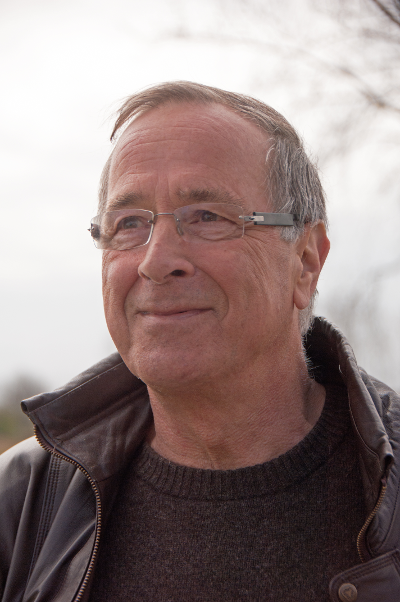

## Welkom op de site van Toon

### Maandag 10 oktober 2016

Met grote verslagenheid melden wij u het overlijden van Toon.

Hij heeft de kans niet gehad om tegen zijn agressieve kanker te strijden, die nog maar net werd vastgesteld.
Zondagmorgen is hij, in ons bijzijn, rustig gestopt met ademen.

Op zaterdag 15 oktober 2016 om 10.00u namen we afscheid van hem in de OLV-kerk van Nieuwpoort.

Nini, Karen, Marjan en Katrijn

Toon was jarenlang leraar  Frans aan het Sint-Bernarduscollege te Nieuwpoort en talencoördinator aan het Vormingsinstituut voor KMO te Veurne.
Gehuwd, vader van drie dochters en grootvader van zes kleindochters en één kleinzoon. Woont te Nieuwpoort sinds zijn prille jeugdjaren. Sinds april 2002 met pensioen! Rustig aan? Wat dacht je! Er is de computer - Google - Facebook - de Franse taal (die me blijft boeien) - museabezoeken - film en theater - ambassadeur voor Nieuwpoort, de Nieuwpoortse garnalen en dagverse vis - I-phone (mijn "speeltje" ) - poëzie (momenteel stadsdichter van Nieuwpoort) - en samen met mijn vrouw zoveel mogelijk daguitstappen maken of citytrips. Over al deze hobby's en passies vindt u   meer informatie als u klikt op onderstaande link
 Ik help graag andere mensen met mijn ervaring en kennis. Geniet er van!
 
> Vakanties met het gezin werden steevast in Frankrijk doorgebracht. Geen streek, geen stad of we zijn er geweest. Ken Parijs als mijn broekzak en Frans-Vlaanderen als mijn achtertuin. (hoewel mijn tuin er erg verwaarloosd bij ligt) Onze nieuwe hobby's:  daguitstappen naar Parijs, Frans-Vlaanderen, de Westhoek, Giverny, Duinkerke, Rijsel, Roubaix of de Somme. Een weekend Parijs, Champagne, Elzas, Normandië, Amsterdam.  En jaarlijks minstens een tiental dagen camping in de buurt van Parijs, gevolgd door een zestal weken Frankrijk, telkens een ander departement. We hebben 17 jaar lang Europa afgereisd met de kampeerwagen, veel verder dan het vertrouwde Frankrijk wagen we ons niet meer. In het najaar traditioneel drie weken Turkije. En steeds met dat vleugje cultuur dat reizen onvergetelijk maakt, maar altijd relax, met heel veel oog en oor voor de leuke en mooie dingen in het leven en in de natuur.

* [Bel]() tel:+3258234001
* [Vind ons op de landkaart](https://maps.google.com/maps?q=Nieuwpoort)
* [Zend ons een e-mail](mailto:toonhill@gmail.com)

### Andere websites:

* <a href="http://home.scarlet.be/~th029779/">Site bij scarlet</a>
 (<a href="home.scarlet.be/th029779/Welkom_op_de_website_van.html">archief</a>)
* [Site bij wix](http://toon0.wix.com/copie-de--toonhill#!) (enkel te zien met flash)  ([archief](toon0.wix.com))
* Vroeger had Toon ook nog een site op [hillewaere.be](http://www.hillewaere.be/) maar dat is nu niet meer zo

<!-- Global site tag (gtag.js) - Google Analytics -->

